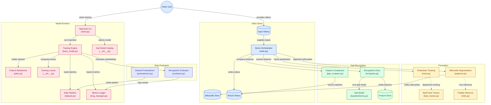

```mermaid
%% Generated by https://gitdiagram.com/jdyjjj/all-in-one-gait
flowchart TD

subgraph group_demo["Video Demo"]
  node_input_videos[("Input Videos")]
  node_demo_main["Demo Orchestrator<br/>[main.py]"]
  node_silhouette_store[("Silhouette Store")]
  node_result_videos[("Result Videos")]
end

subgraph group_perception["Perception"]
  node_tracking["Pedestrian Tracking<br/>[track.py]"]
  node_byte_tracker["ByteTrack Tracker<br/>[byte_tracker.py]"]
  node_segmentation["Silhouette Segmentation<br/>[segment.py]"]
  node_paddle_infer["Paddle Inference<br/>[infer.py]"]
end

subgraph group_recognition["Gait Recognition"]
  node_recognition_entry["Recognition Entry<br/>[recognise.py]"]
  node_gait_model["Gait Model<br/>[baselineDemo.py]"]
  node_feature_store[("Feature Store")]
  node_gait_compare["Feature Comparison<br/>[gait_compare.py]"]
end

subgraph group_runtime["Model Runtime"]
  node_cli_main["OpenGait CLI<br/>[main.py]"]
  node_data_pipeline["Data Pipeline<br/>[dataset.py]"]
  node_model_base["Training Engine<br/>[base_model.py]"]
  node_model_catalog["Gait Model Catalog<br/>[__init__.py]"]
  node_backbones["Feature Backbones<br/>[plain.py]"]
  node_losses["Training Losses<br/>[__init__.py]"]
  node_message_manager["Metrics Logger<br/>[msg_manager.py]"]
end

subgraph group_dataeval["Data Evaluation"]
  node_pretreatment["Dataset Pretreatment<br/>[pretreatment.py]"]
  node_evaluator["Recognition Evaluator<br/>[evaluator.py]"]
end

node_user(("Video User"))

node_user -->|"provides videos"| node_input_videos
node_input_videos -->|"supplies inputs"| node_demo_main
node_demo_main -->|"tracks pedestrians"| node_tracking
node_tracking -.->|"dispatches tracking"| node_byte_tracker
node_demo_main -->|"segments silhouettes"| node_segmentation
node_segmentation -.->|"runs inference"| node_paddle_infer
node_segmentation -->|"writes silhouettes"| node_silhouette_store
node_demo_main -->|"extracts features"| node_recognition_entry
node_recognition_entry -->|"runs gait model"| node_gait_model
node_recognition_entry -->|"writes features"| node_feature_store
node_demo_main -->|"compares features"| node_gait_compare
node_gait_compare -->|"returns matches"| node_result_videos
node_demo_main -->|"writes videos"| node_result_videos
node_user -->|"starts training"| node_cli_main
node_cli_main -->|"selects model"| node_model_catalog
node_cli_main -->|"runs train/test"| node_model_base
node_model_base -->|"loads batches"| node_data_pipeline
node_model_base -->|"builds network"| node_backbones
node_model_base -->|"computes losses"| node_losses
node_model_base -->|"evaluates embeddings"| node_evaluator
node_model_base -->|"reports metrics"| node_message_manager
node_pretreatment -->|"writes pickles"| node_data_pipeline
node_evaluator -->|"logs results"| node_message_manager

click node_demo_main "https://github.com/jdyjjj/all-in-one-gait/blob/main/OpenGait/demo/libs/main.py"
click node_tracking "https://github.com/jdyjjj/all-in-one-gait/blob/main/OpenGait/demo/libs/track.py"
click node_byte_tracker "https://github.com/jdyjjj/all-in-one-gait/blob/main/OpenGait/demo/libs/tracker/byte_tracker.py"
click node_segmentation "https://github.com/jdyjjj/all-in-one-gait/blob/main/OpenGait/demo/libs/segment.py"
click node_paddle_infer "https://github.com/jdyjjj/all-in-one-gait/blob/main/OpenGait/demo/libs/paddle/infer.py"
click node_recognition_entry "https://github.com/jdyjjj/all-in-one-gait/blob/main/OpenGait/demo/libs/recognise.py"
click node_gait_model "https://github.com/jdyjjj/all-in-one-gait/blob/main/OpenGait/demo/libs/model/baselineDemo.py"
click node_gait_compare "https://github.com/jdyjjj/all-in-one-gait/blob/main/OpenGait/demo/libs/gait_compare.py"
click node_cli_main "https://github.com/jdyjjj/all-in-one-gait/blob/main/OpenGait/opengait/main.py"
click node_data_pipeline "https://github.com/jdyjjj/all-in-one-gait/blob/main/OpenGait/opengait/data/dataset.py"
click node_model_base "https://github.com/jdyjjj/all-in-one-gait/blob/main/OpenGait/opengait/modeling/base_model.py"
click node_model_catalog "https://github.com/jdyjjj/all-in-one-gait/blob/main/OpenGait/opengait/modeling/models/__init__.py"
click node_backbones "https://github.com/jdyjjj/all-in-one-gait/blob/main/OpenGait/opengait/modeling/backbones/plain.py"
click node_losses "https://github.com/jdyjjj/all-in-one-gait/blob/main/OpenGait/opengait/modeling/losses/__init__.py"
click node_pretreatment "https://github.com/jdyjjj/all-in-one-gait/blob/main/OpenGait/datasets/pretreatment.py"
click node_evaluator "https://github.com/jdyjjj/all-in-one-gait/blob/main/OpenGait/opengait/evaluation/evaluator.py"
click node_message_manager "https://github.com/jdyjjj/all-in-one-gait/blob/main/OpenGait/opengait/utils/msg_manager.py"

classDef toneNeutral fill:#f8fafc,stroke:#334155,stroke-width:1.5px,color:#0f172a
classDef toneBlue fill:#dbeafe,stroke:#2563eb,stroke-width:1.5px,color:#172554
classDef toneAmber fill:#fef3c7,stroke:#d97706,stroke-width:1.5px,color:#78350f
classDef toneMint fill:#dcfce7,stroke:#16a34a,stroke-width:1.5px,color:#14532d
classDef toneRose fill:#ffe4e6,stroke:#e11d48,stroke-width:1.5px,color:#881337
classDef toneIndigo fill:#e0e7ff,stroke:#4f46e5,stroke-width:1.5px,color:#312e81
classDef toneTeal fill:#ccfbf1,stroke:#0f766e,stroke-width:1.5px,color:#134e4a
class node_input_videos,node_demo_main,node_silhouette_store,node_result_videos,node_user toneBlue
class node_tracking,node_byte_tracker,node_segmentation,node_paddle_infer toneAmber
class node_recognition_entry,node_gait_model,node_feature_store,node_gait_compare toneMint
class node_cli_main,node_data_pipeline,node_model_base,node_model_catalog,node_backbones,node_losses,node_message_manager toneRose
class node_pretreatment,node_evaluator toneIndigo
```
